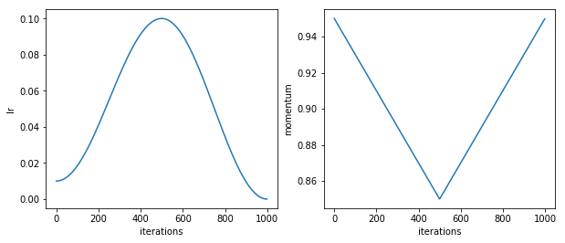
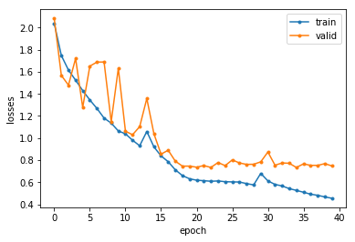
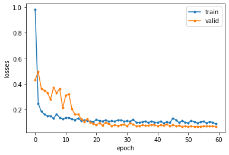

# One Cycle & Cyclic Learning Rate for Keras

This module provides Keras callbacks to implement in training the following:
- [One cycle policy (OCP)](https://arxiv.org/abs/1803.09820)
- [Cyclic learning rate (CLR)](https://arxiv.org/abs/1506.01186)
- Learning rate range test (LrRT)

## Highlights
- Learning rate & Weight decay range test.
- Using callbacks, the module works for datasets of numpy arrays or data generator.
- Common usage as callbacks for both `model.fit` and `model.fit_generator` where `epochs` is intuitively interpreted as cycle lengths.

## Dependencies:
- `tensorflow`
- (optional) `keras`
- `matplotlib`, `numpy`, `pandas`, `tqdm`
- (optional) `numba`

### In detail:
This is inspired by how well fastai library implements this for PyTorch. By the time this module was made, a few options to implement these learning policies in Keras have two limitations: (1) They might not work with data generator; (2) They might need a different way to train (rather than passing a policy as a callback). This module addresses both limitation by defining these training policies as Keras callbacks in such a way that both `model.fit` and `model.fit_generator` can be called. For OPC, the number of `epochs` (argument for fitting) directly represents a cycle length. For LrRT and CLR, `epochs` necessary to complete a training with a particular policy can be calculated from the policy callback's `.find_n_epoch`.

Additionally, the `utils` submodule defines some useful functions such as:
- `plot_from_history` plots train and validation loss (if any) as a function of epochs.
- `concatenate_history` concatenates training and validation losses and metrics from a list of `keras.callbacks.History` which can be obtained from `model.history` after training. This is helpful in connecting histories from multiple one-cycle policy trainings.

## Example of LrRT

```python
lrrt_cb = clr.LrRangeTest(lr_range=(1e-3, 1),
                          wd_list=[0, 1e-4, 1e-3, 1e-2, 1e-1], # grid test for weight decay
                          steps=steps,
                          batches_per_step=b,
                          validation_data=(x_test, y_test), # good to find weight decay
                          batches_per_val=5,
                          threshold_multiplier=5.,
                          verbose=False)

n_epoch = lrrt_cb.find_n_epoch(train_gen)
# n_epoch = lrrt_cb.find_n_epoch(x_train, batch_size) # for numpy array as train set
        
model.fit_generator(generator=train_gen,
                       epochs=n_epoch,
                       verbose=0,
                       callbacks=[lrrt_cb])

lrrt_cb.plot()
```


## Example of OCP
```python
ocp_1_cb = clr.OneCycle(lr_range=(0.01, 0.1),
                     momentum_range=(0.95, 0.85),
                     reset_on_train_begin=True,
                     record_frq=10)

ocp_cb.test_run(1000)  # plot out values of learning rate and momentum as a function of iteration (batch). 1000 is just for plotting. The actual iteration will be computed when model.fit or model.fit_generator is run.
```



```python
# setting ``epochs`` to 20 means a cycle length is 20 epochs.
hist1 = model_kr.fit_generator(generator=train_gen,
                      epochs=20,
                      validation_data=val_gen,
                      callbacks=[ocp_1_cb, checkpoint, tensorboard_cb],
                      verbose=2)

# train for another cycle
ocp_2_cb = clr.OneCycle(lr_range=(0.001, 0.01),
                     momentum_range=(0.95, 0.85),
                     reset_on_train_begin=True,
                     record_frq=10)

hist2 = model_kr.fit_generator(generator=train_gen,
                      epochs=20,
                      validation_data=val_gen,
                      callbacks=[ocp_2_cb, checkpoint, tensorboard_cb],
                      verbose=2)

hist_all = concatenate_history([hist1, hist2], reindex_epoch=True)

plot_from_history(hist_all) # plot train and validation losses versus epochs
```



## Example of CLR
```python
clr_cb = ktool.CLR(cyc=3,
                   lr_range=(1e-2/5, 1e-2),
                   momentum_range=(0.95, 0.85),
                   verbose=False,
                   amplitude_fn=lambda x: np.power(1.0/3, x))

clr_cb.test_run(600) # see that a new cycle starts at 0th, 200th, and 400th iteration.
```


```python
clr_hist = model.fit(x_train, y_train,
                     epochs=60,
                     validation_data=(x_test, y_test),
                     verbose=2,
                     callbacks=[clr_cb])

plot_from_history(clr_hist)
```

